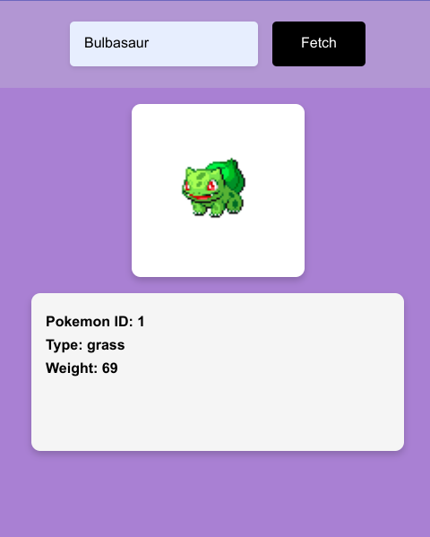
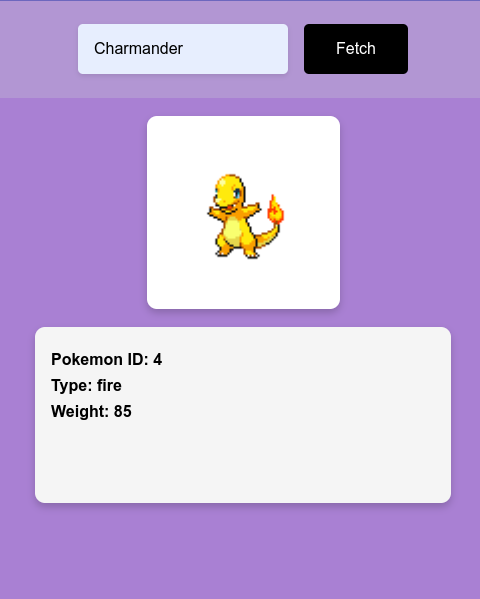
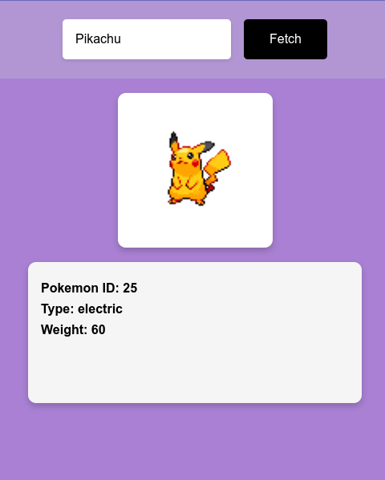
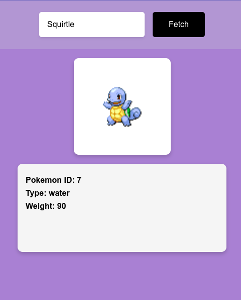

<h1>Pokémon Card Generator</h1>

This repository contains a small project built using HTML, CSS, and JavaScript to fetch Pokémon data from the PokeAPI and display it on a Pokémon card.

<h2>Project Overview</h2>

The project allows users to search for a Pokémon by name and fetch its details, including an image, ID, type, and weight. Upon clicking the "Fetch" button, the website dynamically updates to show the Pokémon card with the fetched information.

<h2>Usage</h2>

<ol>
    <li>Enter the name of the Pokémon you want to search for in the input field.</li>
    <li>Click the "Fetch" button to fetch the Pokémon details from the PokeAPI.</li>
    <li>The Pokémon card will be displayed with the Pokémon's image, ID, type, and weight.</li>
</ol>

<h2>Screenshot</h2>

  
  
  
  

<h2>Cloning the Repository</h2>

To clone the repository to your local machine, use the following command:

<pre><code>git clone &lt;https://github.com/Dark-Programer/pokeapi-pokemon-card.git&gt;</code></pre>
